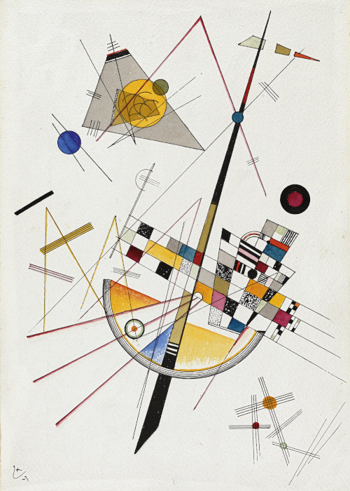
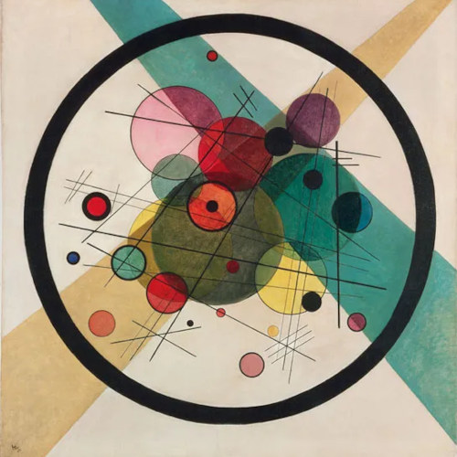

# HW04

## A: Clock Based on Kandinski paintings

|  |  |
--- | ---
|  |  |

### Season:
The background is based on the season in the northern hemisphere. Winter is black, autumn and spring are dark grey and summer is a lighter grey.

### Hour:
There's a translucent triangle whose width is based on the current hour.

### Minute:
The number of minutes is represented by a grid of randomly-colored squares.  
The random seed for the ```draw()``` cycle is set by the current minute, this way the image changes every minute.

### Second:
The number of seconds elapsed in the current minute is represented by an arc that grows from $0^\circ$ to $180^\circ$. The number of lines in the arc represents the hour.

## B: Random drawing interface
---

### lalalalal
