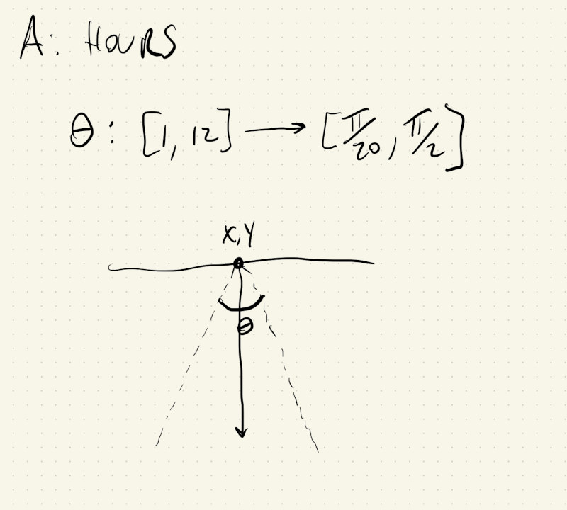
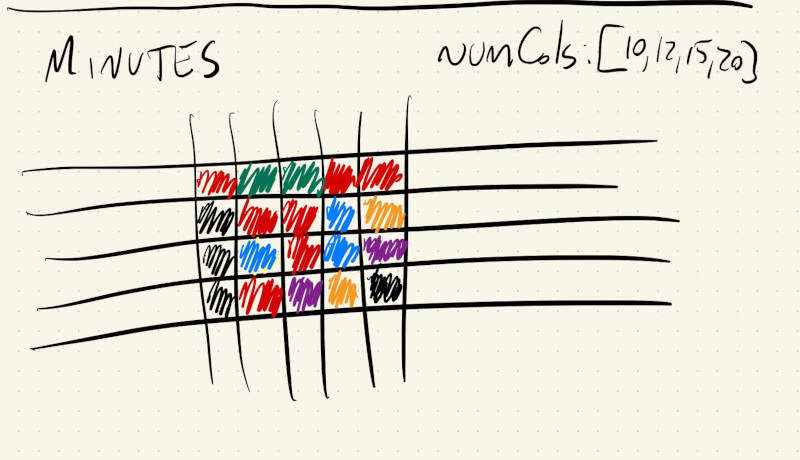
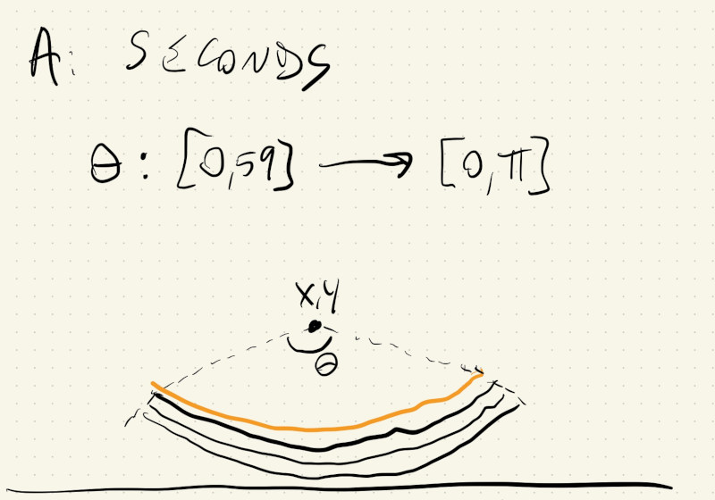

# HW04

## A: Clock based on Kandinsky paintings

|  |  |
--- | ---
|  |  |

### Season:
The background is based on the season in the northern hemisphere. Winter is black, autumn and spring are dark grey and summer is a lighter grey.

### Hour:
There's a translucent triangle whose width is based on the current hour.



### Minute:
The number of minutes is represented by a grid of randomly-colored squares.  
The random seed for the ```draw()``` cycle is set by the current minute, this way the image changes every minute.



### Second:
The number of seconds elapsed in the current minute is represented by an arc that grows from $0^\circ$ to $180^\circ$. The number of lines in the arc represents the hour.



## B: Drawing interface based on Kandinsky paintings
---


### Drawing modes:
Toggle between modes using the space bar.

### Mode 0:
Draw group of 1 to 5 circles around (mouseX, mouseY). Positions are randomly nudged. Color is randomly selected.  
Bonus: Every 10 clicks a ring is drawn around the last 10 groups of circles drawn.

### Mode 1:
Draw grid lines that extend the whole canvas.  
Bonus: Every 5 clicks a triangle is drawn from the top of the screen towards the bottom.
